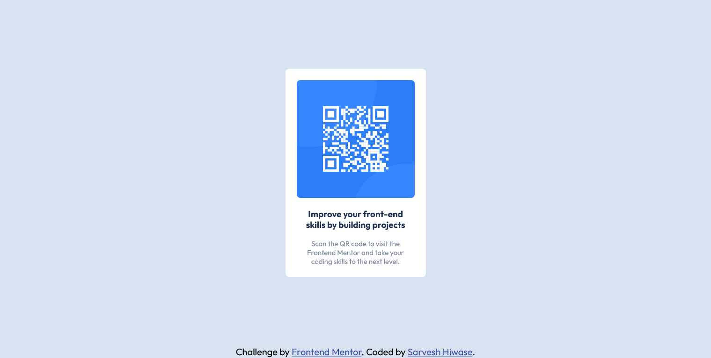

# Frontend Mentor - QR code component solution

This is a solution to the [QR code component challenge on Frontend Mentor](https://www.frontendmentor.io/challenges/qr-code-component-iux_sIO_H). Frontend Mentor challenges help you improve your coding skills by building realistic projects.

## Table of contents

- [Overview](#overview)
  - [Screenshot](#screenshot)
  - [Links](#links)
- [Author](#author)

## Overview

### Screenshot

- Desktop UI 

- Mobile UI 

### Links

- Solution URL: [https://github.com/sarveshhiwase/frontend-mentor-free-challenges/tree/master/challenges/qr-code](https://github.com/sarveshhiwase/frontend-mentor-free-challenges/tree/master/challenges/qr-code)
- Live Site URL: [https://qr-code-challenge.vercel.app/](https://qr-code-challenge.vercel.app/)

## Author

- Website - [Sarvesh Hiwase](https://sarveshhiwase.github.io/)
- Frontend Mentor - [@sarveshhiwase](https://www.frontendmentor.io/profile/sarveshhiwase)
- Github - [@sarveshhiwase](https://github.com/sarveshhiwase)
